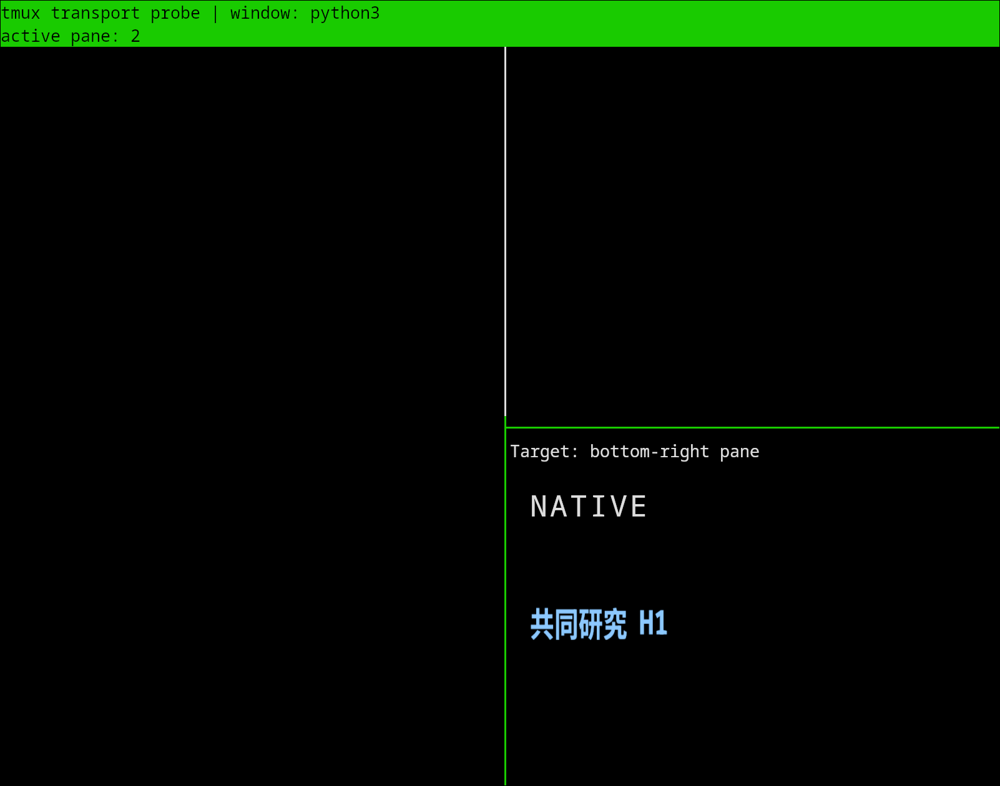
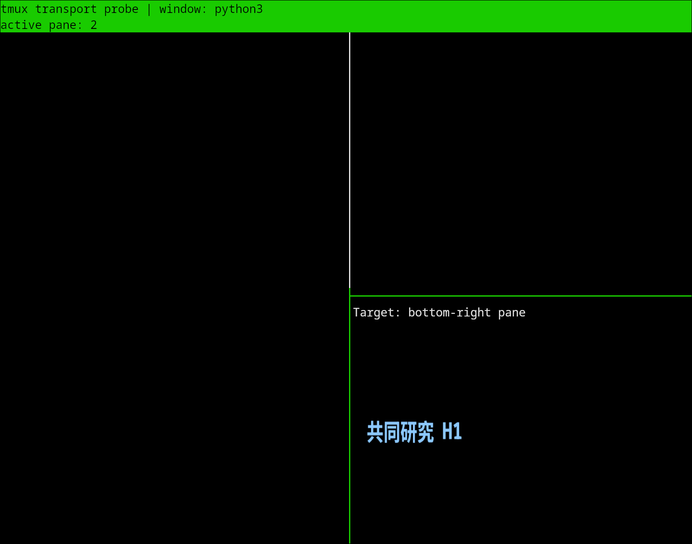
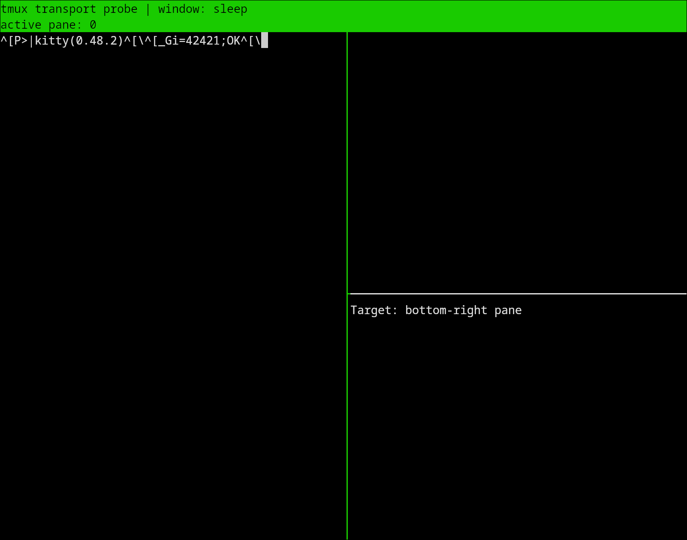
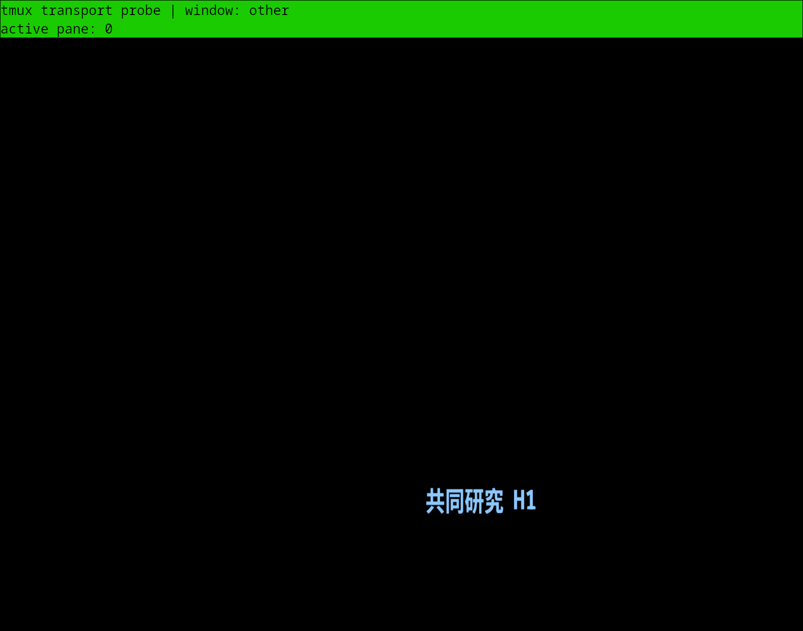
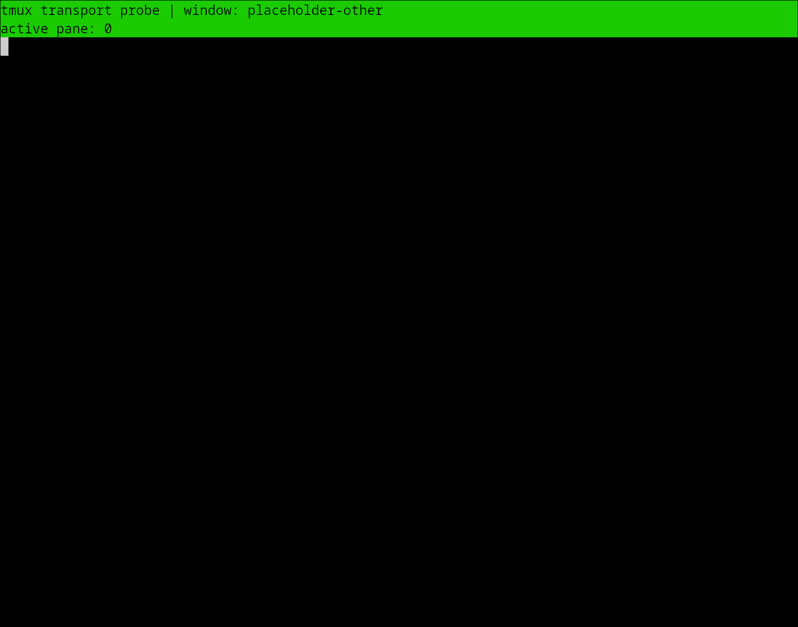

# Kitty/tmux heading transport experiment

Tested with Kitty 0.48.2, tmux 3.7c and Linux/X11, using an isolated server with three panes and two status rows at the top. A raw Python program runs in the bottom-right pane; Neovim and md-render.nvim are deliberately absent. This establishes transport constraints and a candidate image-placement mechanism, not completed plugin support.

## Observed behavior

| Experiment | Result |
| --- | --- |
| Wrapped XTVERSION and PNG queries from the active pane | Kitty version and PNG `OK` replies reach the sender. |
| PNG upload | The terminal acknowledges the actual PNG, independently of OSC 66. |
| Pane-local coordinates sent directly through passthrough | Native text and PNG appear in the top-left pane. |
| Add pane offset and top status rows | Both appear in the intended bottom-right pane. |
| `tmux refresh-client` | Native OSC 66 text disappears; the ordinary PNG placement remains. |
| Switch to another tmux window | The ordinary PNG remains visible over the unrelated window. |
| Explicit placement deletion and native cell cleanup | Both overlays disappear. |
| Disable passthrough | Version and PNG queries receive no reply within the bounded checks. |
| Query from a visible but inactive pane | The sender receives no reply; the version and PNG `OK` replies appear as input in the active pane. |
| Return focus to the sender and query again | Replies reach the sender again. |

Queries match complete response payloads within a two-second bound. The earlier 0.8-second diagnostic also observed a late upload acknowledgement arriving in a newly selected window; the confirmed run waits for the upload acknowledgement before that switch.

| Correct pane placement | After tmux redraw: native text is gone |
| --- | --- |
|  |  |

## Image alternative: Unicode placeholders

[Kitty Unicode placeholders](https://sw.kovidgoyal.net/kitty/graphics-protocol/#unicode-placeholders) let tmux retain image locations as ordinary text cells. After a positively acknowledged PNG upload, the experiment creates a quiet virtual placement and emits a two-row placeholder grid through normal pane output, without absolute outer-terminal coordinates.

Actual image pixels were present initially, after a tmux redraw and after returning to the original window. The unrelated window had zero image pixels. These checks allow up to eight seconds for screen presentation; they do not establish rendering latency or distinguish X11/Wayland presentation behavior.

| Ordinary placement after switching windows | Placeholder placement after switching windows |
| --- | --- |
|  |  |

This makes the existing Snacks placeholder/placement facilities worth evaluating before adding a custom absolute-position image lifecycle. It does **not** solve acknowledgement routing: new uploads and probes still need a safe connection/focus policy. Preserve confirmed uploads before masking text; an inactive pane can defer new image work and remain readable. Reuse must also avoid silently changing the user's tmux passthrough settings.

## Implementation boundary

- Native support (#8) needs pane geometry, client/visibility invalidation, and reassertion after tmux redraws.
- Image support (#11) should first test placeholder integration with the existing measured text projection and Neovim feedback. Search, Visual/yank, mouse hit targets, cleanup, SSH, copy mode and detach/reattach still require plugin-level acceptance.
- Share only proven transport/connection helpers. The raw experiments do not justify a general terminal abstraction or require either complete backend to land first.

The scripts and machine-readable results accompany this report. Reproduction requires Linux/X11, `kitty`, `tmux`, `magick`, Python and Pillow; run `python3 verify-tmux-transport.py` with `tmux-probe-child.py` and `heading.png` beside it. The harness creates and destroys its own tmux server and Kitty window.
